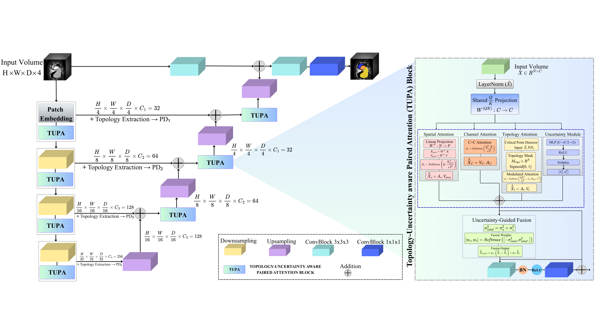

# TUNE++: Topology-Guided Uncertainty Estimation for Reliable 3D Medical Image Segmentation

Official implementation of **TUNE++** (Topology and UNcertainty-aware Efficient transformers) for reliable 3D medical image segmentation.

---

## Highlights

- **First unified framework** jointly modeling segmentation, uncertainty quantification, and topology preservation
- **Novel TUPA mechanism** combining spatial, channel, topology-aware attention with uncertainty-guided fusion
- **State-of-the-art results** on 3 medical imaging benchmarks (Synapse, ACDC, BTCV)
- **72% reduction** in topological errors with superior uncertainty calibration (ECE 0.043)
- **Clinically reliable** predictions with anatomically plausible topology
---

## Architecture



**TUPA Block:** Four parallel branches (spatial, channel, topology, uncertainty) with uncertainty-guided adaptive fusion.

---

## Results

### Quantitative Results

| Dataset | Method | Mean DSC ↑ | Betti Error ↓ | ECE ↓ | TAUS ↑ |
|---------|--------|-----------|---------------|-------|--------|
| **Synapse** | UNETR++ | 87.2 | 1.34 | - | - |
| | **TUNE++** | **89.3** | **0.34** | **0.042** | **0.81** |
| **ACDC** | UNETR++ | 92.4 | 1.38 | - | - |
| | **TUNE++** | **93.8** | **0.42** | **0.038** | **0.81** |
| **BTCV** | UNETR++ | 82.3 | 2.12 | - | - |
| | **TUNE++** | **84.8** | **1.88** | **0.041** | **0.79** |

### Key Improvements
- **+2.3% mean DSC** improvement across all datasets
- **72% Betti error reduction** (1.94 → 0.54 average)
- **Superior calibration** (ECE 0.043 vs. 0.099 for baselines)
- **High TAUS correlation** (r=0.78) between uncertainty and topological complexity

---

<!-- ### Prerequisites
```bash
Python >= 3.8
PyTorch >= 2.0
MONAI >= 1.3.0
GUDHI >= 3.7.1 (for persistent homology)
```

### Training
```bash
# Coming soon
```

### Inference
```bash
# Coming soon
```

---

## Datasets

We evaluate TUNE++ on five public benchmarks:

- **Synapse Multi-Organ** ([Link](https://www.synapse.org/#!Synapse:syn3193805/wiki/217789))
- **ACDC Cardiac** ([Link](https://www.creatis.insa-lyon.fr/Challenge/acdc/))
- **BTCV Multi-Organ** ([Link](https://www.synapse.org/#!Synapse:syn3193805/wiki/217752))

---

**Status:** Code release in progress.
--- -->


## Installation

### Requirements
```bash
Python >= 3.8
PyTorch >= 2.0.0
MONAI >= 1.3.0
GUDHI >= 3.7.1
```

### Setup
```bash
# Clone repository
git clone https://github.com/YourUsername/TUNE-plusplus.git
cd TUNE-plusplus

# Create conda environment
conda create -n tune python=3.9
conda activate tune

# Install dependencies
pip install -r requirements.txt
```

---

## Datasets

Download the following public benchmarks:

### 1. Synapse Multi-Organ CT
- **Link:** [Synapse](https://www.synapse.org/#!Synapse:syn3193805/wiki/217789)
- **Classes:** 8 organs (aorta, gallbladder, kidney L/R, liver, pancreas, spleen, stomach)
- **Images:** 30 abdominal CT scans
- **Resolution:** 512×512×(85-198) slices

### 2. ACDC Cardiac MRI
- **Link:** [ACDC](https://www.creatis.insa-lyon.fr/Challenge/acdc/)
- **Classes:** 3 structures (RV cavity, myocardium, LV cavity)
- **Images:** 100 cardiac cine-MRI sequences
- **Resolution:** 216×256×(6-18) slices

### 3. BTCV Multi-Organ CT
- **Link:** [BTCV](https://www.synapse.org/#!Synapse:syn3193805/wiki/217752)
- **Classes:** 13 organs (spleen, kidneys, gallbladder, esophagus, liver, stomach, aorta, IVC, portal vein, pancreas, adrenal glands)
- **Images:** 50 abdominal CT scans
- **Resolution:** Similar to Synapse

Place datasets in `./data/` following this structure:
```
data/
├── Synapse/
│   ├── imagesTr/
│   └── labelsTr/
├── ACDC/
│   ├── training/
│   └── testing/
└── BTCV/
    ├── imagesTr/
    └── labelsTr/
```

---

## Training

### Basic Training
```bash
# Train on Synapse dataset
python train.py --config configs/synapse.yaml

# Train on ACDC dataset
python train.py --config configs/acdc.yaml

# Train on BTCV dataset
python train.py --config configs/btcv.yaml
```

### Configuration

Edit `configs/synapse.yaml` to customize training:
```yaml
training:
  batch_size: 2              # Adjust based on GPU memory
  num_epochs: 1000
  learning_rate: 0.0001
  optimizer: "adamw"
  weight_decay: 0.0001
  
loss:
  lambda1: 0.3    # Topology loss weight
  lambda2: 0.2    # Uncertainty loss weight
  lambda3: 0.1    # Calibration loss weight
  lambda4: 0.15   # Hierarchical loss weight
```

### Loss Weight Sensitivity

TUNE++ is robust to loss weight variations:
- **±33% perturbation:** Performance degrades by only 0.2-0.4% DSC
- **Uniform weighting (1:1:1:1):** Only 0.2% DSC drop
- **10× scaling:** Negligible impact on performance

See Appendix A.1 in paper for detailed sensitivity analysis.

---

## Inference

### Single Image Inference
```bash
python inference.py \
    --config configs/synapse.yaml \
    --checkpoint saved_models/best_model.pth \
    --input path/to/test_image.nii.gz \
    --output predictions/
```

### Batch Inference
```bash
python inference.py \
    --config configs/synapse.yaml \
    --checkpoint saved_models/best_model.pth \
    --input_dir data/Synapse/imagesTs/ \
    --output_dir predictions/
```

### Monte Carlo Dropout

For uncertainty quantification, MC dropout is enabled by default (25 samples):
```python
from models import TUNEPlusPlus
from utils.uncertainty import monte_carlo_inference

model = TUNEPlusPlus(...)
mean_pred, aleatoric, epistemic = monte_carlo_inference(
    model, input_tensor, num_samples=25
)
```

---

## Methodology

### TUPA Block

The core innovation is the **Topology-Uncertainty Aware Paired Attention** mechanism:

1. **Shared Query-Key Projection:** Efficient parameter sharing across branches
2. **Spatial Attention:** Dimensionality reduction from O(N²C) to O(NPC) where P << N
3. **Channel Attention:** Feature recalibration across semantic channels
4. **Topology-Aware Attention:** Critical point detector identifies boundaries, junctions, anomalies
5. **Uncertainty Estimation:** Dual MLP for aleatoric + epistemic uncertainty
6. **Adaptive Fusion:** Uncertainty-guided weighting balances data-driven vs. structure-driven features

**Key Insight:** High uncertainty regions rely more on topology (strong priors), while confident regions rely on data-driven attention.

### Loss Functions

**Total Loss:**
```
L_total = L_seg + λ₁L_topo + λ₂L_unc + λ₃L_calib + λ₄L_hier
```

- **L_seg:** Dice + Cross-Entropy for segmentation accuracy
- **L_topo:** Persistent homology + Betti numbers + critical points for topology preservation
- **L_unc:** Aleatoric + Epistemic + Alignment for uncertainty decomposition
- **L_calib:** ECE + Brier score for calibration
- **L_hier:** Multi-scale persistence diagram consistency

**Default Weights:** λ₁=0.3, λ₂=0.2, λ₃=0.1, λ₄=0.15

### Topological Complexity Score
```
C_topo = w_b × Boundaries + w_j × Junctions + w_a × Anomalies
```

- **w_b=1.0:** Organ boundaries (baseline difficulty)
- **w_j=2.0:** Multi-organ junctions (higher complexity)
- **w_a=3.0:** Topological anomalies (severe violations)